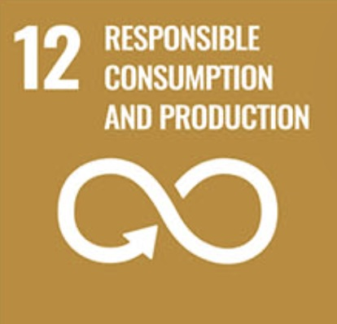
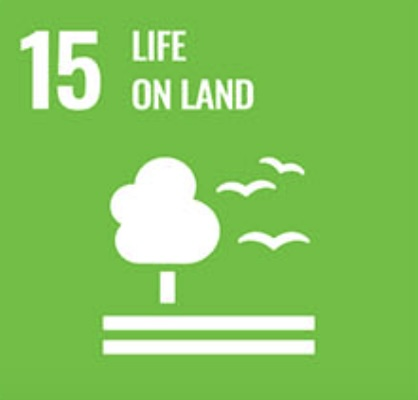
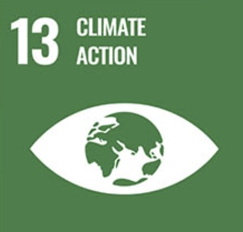

# Connections to the  Sustainable Development Goals {#intro}

## SDG 12 

{width="50%"}

Farmer’s intricate and complex stories and connections to the land change have impacts on how farmland is managed and cultivated. These stories are very much a part of the food we consume and how it is produced. Listening to and understanding these stories is vital in cultivating sustainable practices and changing the way our food is produced. We must acknowledge the nuances of food production to achieve** Responsible Consumption and Production within our food system.**
 Production side nuances: 
We need enough food to feed a growing population, and thus our food system relies on high-yield systems. 
Farmers have to make a living, our food system incentivises high-yield large operations, and thus, farmers have to be big to make a living. 
 These high-yield systems rely on large amounts of inputs such as fertilizers and pesticides. 
These are expensive and are more afforidible are large scale operations. 
Small-scale regenerative farming does not rely on these inputs and can improve environmental factors such as soil health and biodiversity, but can produce less food. 
Many farmers have lived on the land for generations and have cultivated a way of managing and caring for the land through deep cultural and  personal connections. 
These connections are intertwined with identity and can be hard to change or reshape. 
Consumer side nuances: 
As consumers, we are disconnected from the production of food altogether, so they increasing unaware of our own impacts. 
By hearing and understanding the stories of people producing food, we can repair that connection to the land our food is grown on and better understand our own impacts. 
As consumers, we often criticize the management of land from afar when we are contributing to the demands that farms are trying to meet. 
Responsible Consumption and Production within our food system is about reconciling all of these complexities and cultivating a system where we are all changing together, not just pointing fingers at one another. Sharing these stories is an important starting point. 

## SDG 13 and 15

{width="50%"}

{width="50%"}

For decades, conservation efforts have focused on land use change from forested timberland to agriculture. Throughout this time, biodiversity, habitats, and entire ecosystems have been threatened by deforestation and the conversion of land to farmland. Now, a new phase of threat has emerged, as these same agricultural lands are increasingly being lost to development. 

This land use change is disassembling ecosystems, leading to significant losses in biodiversity and increased habitat fragmentation. 

Increased development and the removal of agricultural land also contribute to climate change and global warming by degrading the land’s productivity. Farming practices themselves can also contribute to environmental degradation. Monoculture crop production, intensive tilling, irrigation, and industrial-scale agriculture can all have harmful impacts on the environment.

But really… it is all connected... 

## Connections to Other SDGs

Due to the complexities of agriculture and farming, this project relates to a broad range of SDGs. In interviews with local farmers, many interconnected issues were mentioned, including links to the following goals:
1. No Poverty

2. Zero Hunger

3. Good Health and Well-Being

4. Quality Education

5. Gender Equality

6. Clean Water and Sanitation

7. Decent Work and Economic Growth

8. Industry, Innovation and Infrastructure

9. Reduced Inequalities

10. Sustainable Cities and Communities
