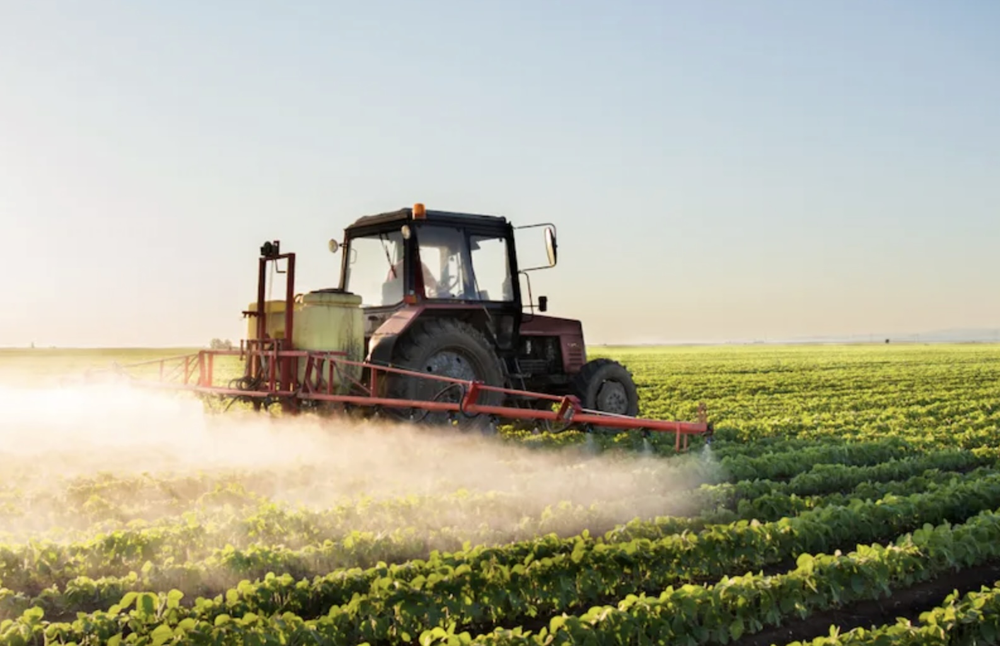
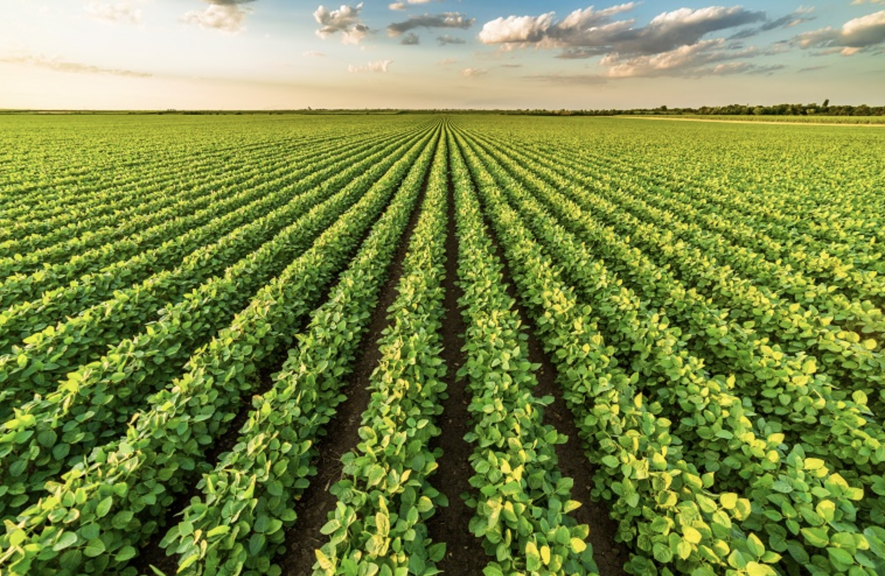

# As an Environmentalist

This is the first image that comes up when you Google “agriculture.” 

{width="50%"}

As an environmentalist, ecologist, or conservationalist, it is easy to look at a field like this and only see its problem. When I look at large monoculture cropland, it is hard for me to look past the environmental and ecological degradation it causes. Within this perspective, I see enormous losses in biodiversity and landscapes reduced to a single crop. I see degraded soils and a weakened microbial ecosystem. To me, it reflects a breakdown of natural complexity and the interconnections among organisms that create a healthy system. I see industrial agriculture as a highly inefficient use of resources, often driven by short-term productivity rather than long-term ecological health. And in many aspects, these views are valid. Industrial-scale agriculture has enormous environmental impacts that are contributing to habitat loss, gas emissions, soil erosion, water silting, soil degradation, biodiversity loss, climate change, and a whole slew of other environmental issues.

{width="50%"}

## Environmental Degradation of Industrial Agriculture 

- Loss of biodiversity

- Soil degradation

- Weakened microbial systems

- Resource inefficiency

- Increased vulnerability

## Perceptions of Industrial Agriculture 

As environmentalists looking at a monoculture field, it is easy to think that the people managing this land, the farmers, are ignoring these problems or don’t value the same things. It can feel thoughtless and only in the pursuit of economic gain and mass production. There is a common perception of monocultures. 

