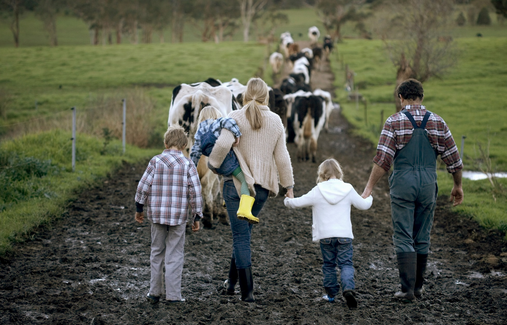

# As a Farmer 

Before recognizing the complex connection and stories of farmers, it is easy to only recognize the ecological and environmental downsides of industrial agriculture. I know that before I began listening to the stories of farmers, I also assumed that our values (mine as an environmentalist and theirs as farmers) were quite different. Yet, the values behind these monoculture crop lands are seemingly quite different from what one might think. Many (most) farmers aren’t indifferent to the land and aren't making thoughtless decisions on their farm. Instead, they’re deeply tied to it and inherently reliant on it and its natural systems. For many farmers, the land provides: 

- A sense of identity 

- A spiritual connection 

{width="50%"}

Many farmers value their land as a place to pass on memories and raise children as well as a space to learn new things.  

All farmers we have interviewed have considered themselves **stewards** of their land. 

(**Stewardship** is the careful and responsible management of something entrusted to one’s care.) 

Farmers like Joshua have grown up for generations on these farms, and they have deeply tied connections with their land. 

