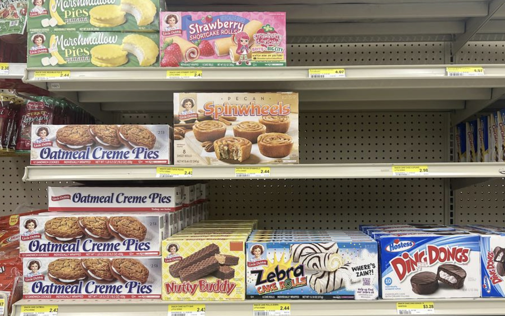
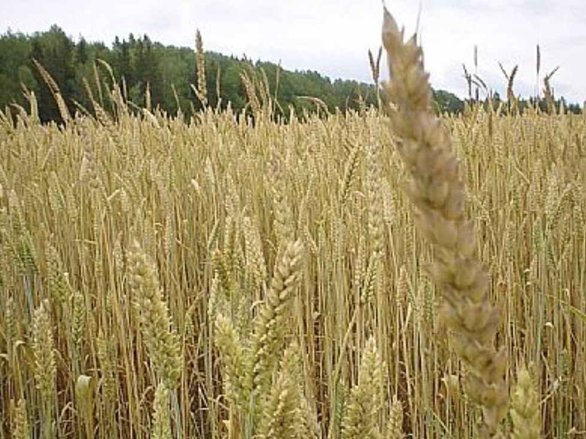

--- 
title: "Looking Under the Crop and into the Weeds"
author: "Sarah Grace Burns"
date: "`r Sys.Date()`"
site: bookdown::bookdown_site
output: 
  bookdown::gitbook:
    config:
      sharing:
        facebook: false
        twitter: false
documentclass: book
bibliography: [bibliography.bib]
biblio-style: apalike
link-citations: yes
github-repo: https://github.com/ericmkeen/bookdown_minimal
description: "DESCRIPTION yall."
---

# Introduction

```{r eval=FALSE, echo=FALSE}
install.packages("bookdown")
# or the development version
# devtools::install_github("rstudio/bookdown")
```

This morning, what did you have for breakfast?

A bowl of oatmeal? 

Cereal? 

Eggs and bacon? 

Or just a cup of coffee?

Maybe even a microwaved Little Debbie on your way out the door. 

{width="50%"}

Whatever you ate, it didn’t just appear in your pantry or even on the shelf at the grocery store; it all started at a farm. 
And I bet you didn’t think much about where that food actually came from this morning as you walked out the door.

That Little Debbie? The wheat in it may have come from a farm down near Winchester.

All the food we eat comes from farms. Yet as a society, we’ve become increasingly separated from our food’s origins. We forget where it was grown, how it was grown, and—more importantly—we forget about the people who grow it.

{width="50%"}

Take that wheat from near Winchester. It might come from a farm run by someone like Jacob. Jacob was born and raised on that land. 
His father was too. 
And his grandfather.
His great-grandfather first settled there in his twenties, planting the crops on the land that fed his family.
Since then, the farm has grown tremendously, now spanning around 4,000 acres of wheat, corn, and soybeans. Jacob remembers being a kid, riding along with his dad during planting season, watching his him drive tractors in perfectly straight rows that no matter how hard he tries, he can’t compete with.

Every farm across America has a story. Many run generations deep. For decades, families have been tied to the land not just through work, but through memory, identity, and life itself. It’s where they grew up. Where they raised their families. Where they built their house and played outside. 

As consumers, it’s easy to forget these connections.

As conservationists and environmentalists, it can be just as easy to overlook them and criticize large-scale agriculture.

But it’s vital that we recognize and understand the complexities behind farming and our food production. We need to recognize how consumer demand shapes decisions, how practices evolve over generations, and how deeply farmers are connected to the land they work.
Understanding these relationships matters in order for us to continue to adapt and cultivate food production in a sustainable way. And we mustn’t forget them.


```{r include=FALSE}
# automatically create a bib database for R packages
knitr::write_bib(c(
  .packages(), 'bookdown', 'knitr', 'rmarkdown'
), 'packages.bib')
```
